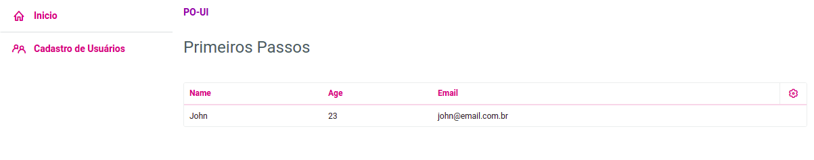

<h1 align="center">
    Primeiro Projeto com PO-UI  
</h1>
<h1 align="center">
  
</h1>

	
  

  
  
  

  <a href="#sobre">Sobre</a>&nbsp;&nbsp;&nbsp;|&nbsp;&nbsp;&nbsp;
  <a href="#po-ui">PO-UI</a>

# Sobre

Projeto criado com o objetivo de entender o básico do funcionamento e utilizaço do PO-UI.

<h1 align="center">
    
</h1>

## PO-UI

O PO-UI é uma biblioteca de componentes da TOTVS.
Para mais informações acesse [PO-UI](https://po-ui.io/)
